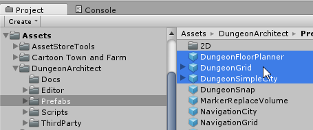
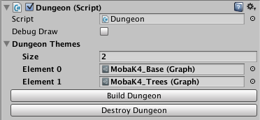
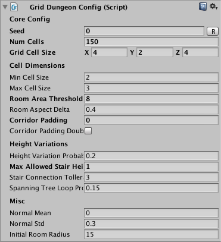

Dungeon Prefab
==============
A dungeon prefab is used to build your dungeons.   Dungeon Architect supports building dungeons with different layouts.  The current supported ones are Grid, SimpleCity and Floorplan.   Drop the appropriate dungeon prefab into the scene and reset its transform

The dungeon game object generate a procedural layout for your dungeon based on the various configuration paramters.  
After the layout has been generated, it spawns meshes, lights, blueprints etc, based on the mappings you have defined in the Theme file.   This way you can define what meshes needs to be attached to the floors, walls, ceilings, etc

Properties
----------
The Dungeon game object lets you perform various actions on your procedural dungeon.  Select the Dungeon game object and have a look at the configuration in the Inspector window

**Build Dungeon:** Builds a procedural dungeon.  You need to define atleast one theme before you build

**Destroy Dungeon:** Destroys an existing dungeon owned by this actor.  If you want to rebuild a dungeon after modifying the theme, there is no need to destroy first and you can directly click build

**Themes:** A theme file lets you design the look and feel of your dungeon.  The theme editor lets you interactively design your own themes.  You need to specify atleast one theme file before you can build your dungeon (sample content comes with many pre-created themes to get you started)

**Debug Draw:** Draws debug information in the scene view

Config Parameters
-----------------
Select the Dungeon Actor and navigate to the Inspector window

The various config parameters determine how the layout of the dungeon is generated procedurally.  The default layout generator algorithm is implemented based on the excellent [writeup](http://www.reddit.com/r/gamedev/comments/1dlwc4/procedural_dungeon_generation_algorithm_explained/) by TinyKeep's author Phi Dinh

The various parameters are:

* **Seed**: Changing this number would completely change the layout of the dungeon.  This is the base random number seed that is used to build the dungeon.  There is a convenience function to randomize this value (button labeled R) 
* **Num Cells**: The number of cells to use while building the dungeon.  You will not see these cells in the final result.   A larger number would create a bigger and more complex dungeon.   A number of 100-150 builds a medium to large sized dungeon. Experiment with different ranges
* **Grid Cell Size**: The dungeon generator works on a grid based system and required modular mesh assets to be placed on each cell (floors, walls, doors etc).   This important field specifies the size of the cell to use. This size is determined by the art asset used in the dungeon theme designed by the artist.  In the demo,  we have a floor mesh that is 400x400.  The height of a floor is chosen to be 200 units as the stair mesh is 200 units high.  Hence the defaults are set to 400x400x200.   You should change this to the dimension of the modular asset your designer has created for the dungeon

* **Min/Max Cell Size**: This is how big or small a cell size can be. While generation, a cell is either converted to a room, corridor or is discarded completely.  The Cell width / height is randomly chosen within this range
* **Room Area Threshold**: If a cell size exceeds past this limit, it is converted into a room.  After cells are promoted to rooms, all rooms are connected to each other through corridors (either directly or indirectly. See spanning tree later)
* **Room Aspect Delta**: The aspect ratio of the cells (width to height ratio).  Keeping this value near 0 would create square rooms.   Bringing this close to 1 would create elongated / stretched rooms with a high width to height ratio
* **Corridor Padding:** The extra width to apply to one side of a corridor
* **Corridor Padding Double Sided:** Flag to apply the padding on both sides of the corridor

* **Height Variation Probability**: Tweak this value to increase / reduce the height variations (and stairs) in your dungeon.  A value close to 0 reduces the height variation and increases as you approach 1.   Increasing this value to a higher level might create dungeons with no place for proper stair placement since there is too much height variation.   A value of 0.2 to 0.4 seems good
* **Max Allowed Stair Height**: The number of logical floor units the dungeon height can vary. This determines how high the dungeon's height can vary (e.g. max 2 floors high).   Set this value depending on the stair meshes you designer has created. In the sample demo, there are two stair meshes, one 200 units high (1 floor) and another 400 units high (2 floors).  So the default is set to 2
* **Spanning Tree Loop**:  Determines how many loops you would like to have in your dungeon.  A value near 0 will create fewer loops creating linear dungeons.   A value near 1 would create lots of loops, which would look unoriginal.  Its good to allow a few loops so a value close to zero (like 0.2 should be good)
* **Stair Connection Tolerance**: The generator would add stairs to make different areas of the dungeon accessible.  However, we do not want too many stairs. For e.g., before adding a stair in a particular elevated area, the generator would check if this area is already accessible from a nearby stair. If so, it would not add it.   This tolerance parameter determines how far to look for an existing path before we can add a stair.   Play with this parameter if you see too many stairs close to each other, or too few
* **Normal Mean / Std**: The random number generator used in the dungeon generator does not use a uniform distribution.  Instead it uses a normal distribution to get higher frequency of lower values and fewer higher values (and hence fewer room cells and a lot more corridor cells). Play with these parameters for different results
* **Initial Room Radius**: Internal Usage.  Keep to a low value like 10-15

