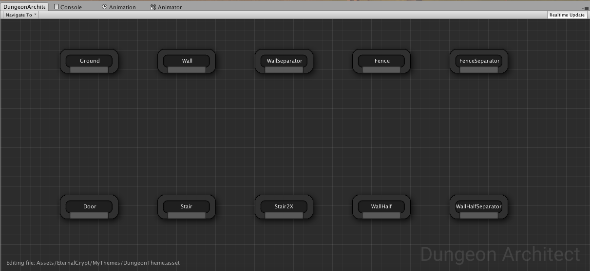
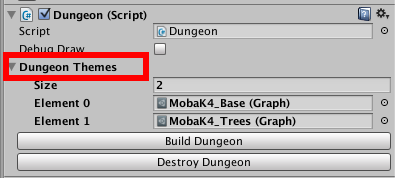

Theme Editor
============

Double click a dungeon theme asset to open it in the `Theme Editor`

Interactive Editing
-------------------

As you design your theme, the scene view automatically gets updated based on your theme graph mapping.   To make this happen, you need to have a dungeon game object in the scene with the current theme being edited applied to it

Whenever you change the theme, the theme editor would search for a dungeon game object in the scene (that has this theme applied to it) and rebuild it.  This way, you get an immediate visual feedback while designing the look and feel of you levels

