Theme Nodes
===========

A Theme can have 3 category of nodes

* **Marker Nodes**
* **Visual Nodes**
* **Marker Emitter Nodes**

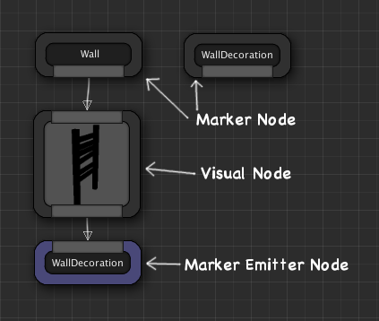

Marker Nodes
------------
After the layout generation phase, the scene would be scattered with invisible named points called **Markers**.   Then, for every marker point in the scene, the theming engine looks for a corresponding **Marker Node** with that marker name.   If found, it would start executing all the nodes defined below the marker node.

For e.g., if you have a marker node named `Ground`,  it would be invoked for every `Ground` marker found in the scene.  Once invoked, the theming engine executes all the nodes defined below it from left to right untill a certain condition is met

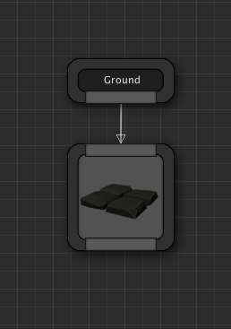

In the above example:

1. In the first phase, the layout builder has populated the map with ground markers, wherever a ground mesh was expected.  
2. Then in the next phase, the theming engine ecounters the `Ground` marker while iterating through all the markers in the scene
3. It then looks for a **Marker Node** named `Ground` in the theme graph
4. Once found, it executes the visual nodes defined below it, starting from left to right

When you create a new theme asset, the theme graph comes with a set of default marker nodes.

You can define new marker nodes and build your own hierarcy for advanced theming

Names of custom marker nodes can be changed by double clicking on them, or from the details tab

###Creating marker nodes

To create a marker node, right click anywhere in the empty area and choose **Add Marker Node**

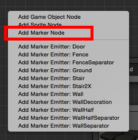

Visual Nodes
------------
Visual nodes are used for spawning visual objects into the scene (e.g. any game objects, sprites etc).   They are usually attached to a marker node and executed whenever an marker with that name is encountered in the scene.   When executed, it spawns a game object defined within it and places it in the scene where the marker was encountered

You can create the following visual nodes:

* **Game Object Node** - Spawns any type of a game object.  Expects a game object template (e.g. prefabs)
* **Sprite Node** - Spawns a sprite for your 2D games.   Expects a sprite reference.  Also have sprite specific properties

###Creating visual nodes

There are several ways to create a new visual node:

Drag and drop a game object from the *Project* window on to the theme editor to create a Game Object or Sprite node

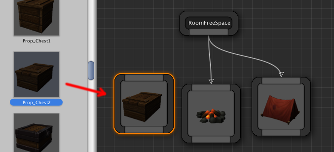

Alternatively, drag a link out of the marker node you intend to attach it on and select the appropriate visual node you desire

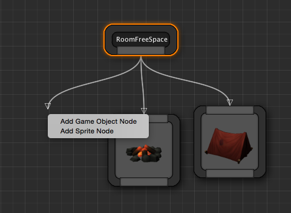

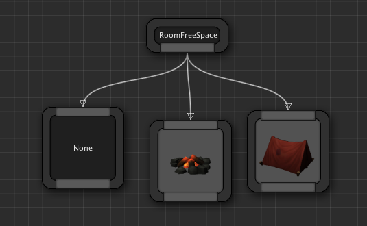

Then select the node and assign the game object template from the inspector window

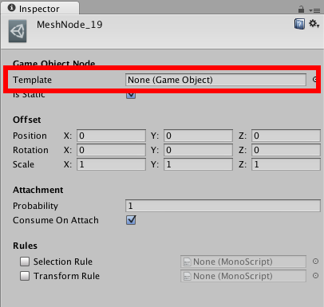

Marker Emitter Nodes
--------------------
Marker Emitters emit new markers into the scene.  These nodes are attached to visual nodes and if the parent visual node is executed, it would insert a named marker into the scene.

**Marker Emitter** nodes are similar in apperarance to Marker Nodes.  However, they are purple in color and have an input pin, instead of an output pin

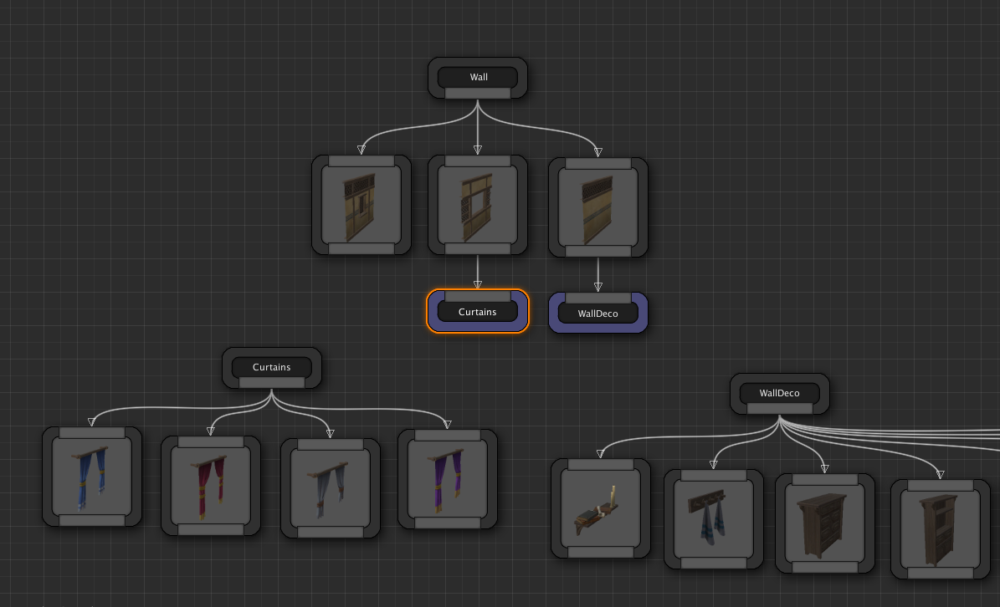

In the above example,  the `Wall` Marker has 3 Mesh nodes attached to it with probability such that any one for the 3 would be randomly chosen.   
One of the 3 meshes has a window in it and we would like to decorate that mesh with curtains, but only if that node is selected.    So, we define a new Marker named `Curtains` (can be any name) and attach curtain meshes to it.
Then we **emit** a `Curtain` Marker Node from the desired visual node.   Hence, if the mesh in the middle is executed, it would also insert a marker named *Curtain* in its position.   Then the theming engine would execute everything beneath the `Curtain` marker and pick a random curtain and attach to the wall

This ability of defining your own hierarchy lets you design powerful themes for your levels

###Creating marker emitter nodes
To create a **Marker Emitter** Node, drag a link out of a visual node and select a marker name you would like to emit

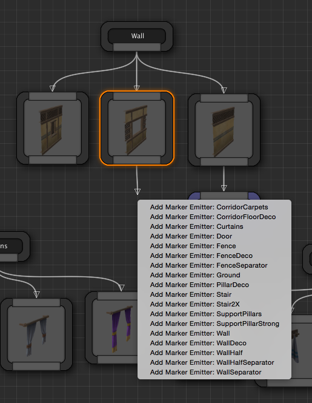

Alternatively, right click anywhere in the empty area and expand the `Marker Emitters` category and click choose a marker to emit

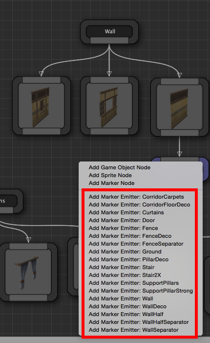

You can create a marker emitter for any of the existing markers in the scene

###Cycles

Cycles are not allowed when you emit markers since we do not want to continuously emit markers in an infinite loop

The editor takes care of not allowing cycles and notifies you with a user-friendly message when you attempt to create a connection with a marker emitter that might cause a loop

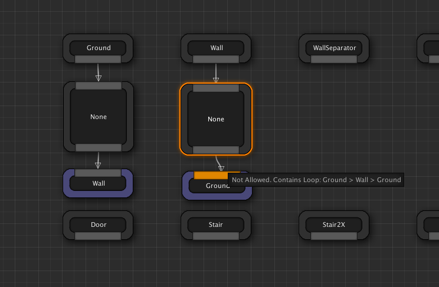

