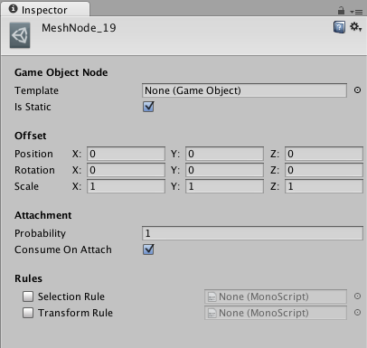
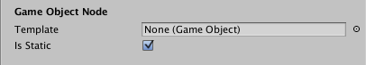
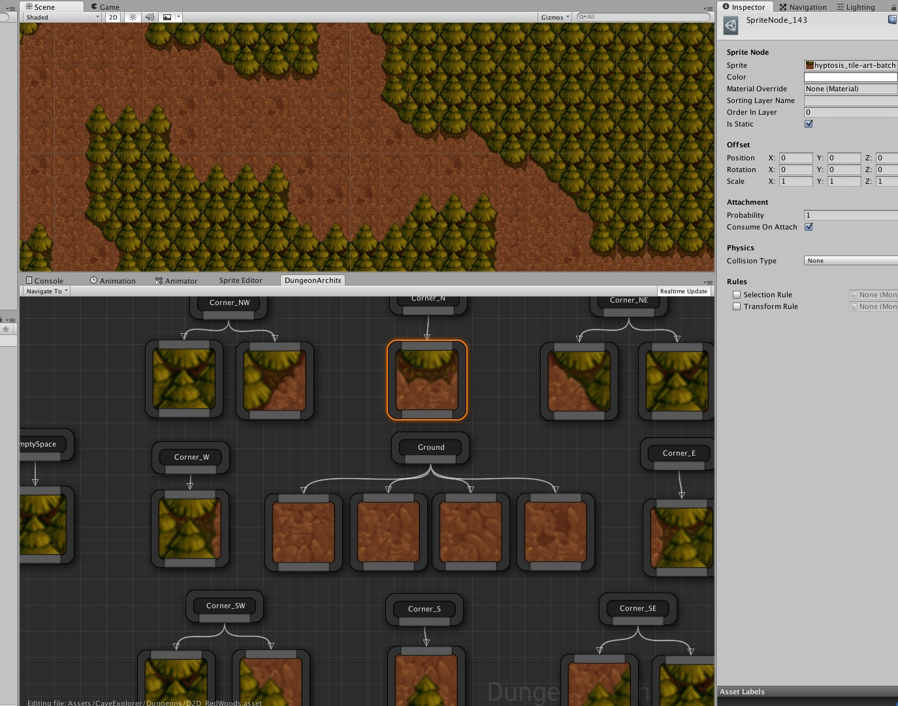
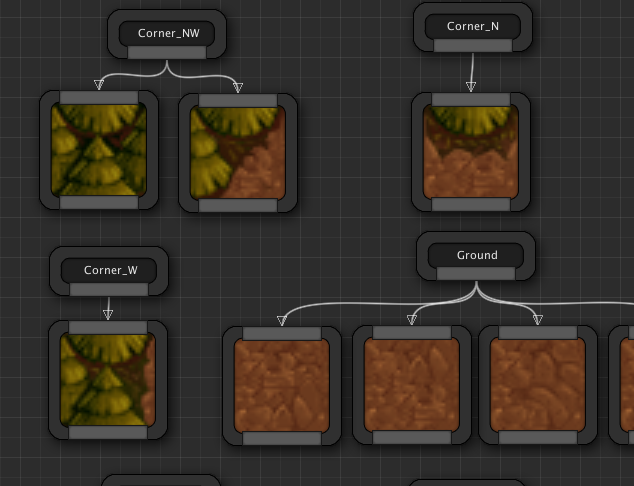
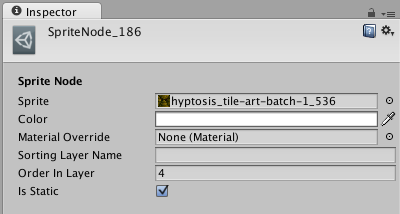
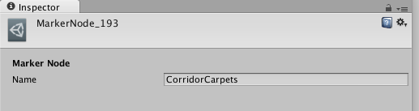
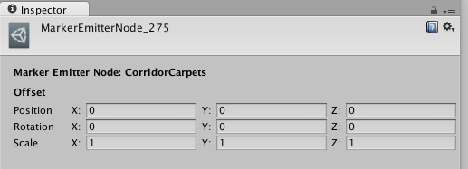

Theme Node Properties
=====================

A node in the theme graph can be customized from the Details Tab

Visual Nodes
------------
Select a visual node (e.g. a Game Object node) and have a look at the details tab:

The properties that are common to all Visual nodes (Game Object, Sprite etc) are explained below:

**Offset:** Apply transformation offset to your visual object relative to the marker location.  This is a very useful property while designing your theme.   If the pivot of the mesh your artist has designed isn't where you wish it were, you can easily adjust it here to translate / rotate it around.  You can also scale objects if they are too small / big.  While designing your theme, you'll find this property useful to re-position your visual nodes, if required.

**Probability:**  This is the probability of attachment.  When this node is executed, the theming engine looks at this variable and rolls a dice and decides whether to insert this visual object into the scene or not.  If this value is 1.0, then it would insert it 100% of the time.  If the value is 0, then it would not insert it since selection probability 0%.  If it is 0.5, then it would insert it 50% of the time

**Consume on Attach:** If the visual object was indeed spawned into the scene (based on the probability above), the theming engine would then look at this flag to decide if we need to execute the next sibling visual node.  If it is checked, then execution stops for this marker.  If it is unchecked, the next sibling gets processed.  *Affinity* and *Consume on Attach* can be combined to create interesting possiblities in your theme

**Selection Logic:** Lets you define selection logic scripts.  You have seen an example above of node selected based on random probability (Probability property).   The selection process can be far more power than a simple random probability based selection.  You can define you own behavior scripts and assign it here so your custom logic can decide if a node is to be selected or not.  More details below

**Transform Logic:** In the Offset property as seen above, you can define a static offset transformation to move/scale/rotate the visual object from the marker position.  With Transform Logic, your behavior scripts can provide dynamic tranform offsets based on a logic.  For e.g., you might want to rotate/scale/translate a tree randomly to give natural variation instead of having them all face the same direction.  More on this later

### Game Object Node
A game object not lets you instantiate any type of game object on the scene

**Template:** Specify a game object template (prefab) to spawn in the scene.  The node's thumbnail will update to reflect the game object assigned here

**Static**: Set this if you want to make your object static.   If you are spawning dynamic objects (like NPCs), then uncheck this flag

### Sprite Class Node

If you are making a 2D game, you'll use **Sprite nodes** to build your scene

Here are the sprite specific parameters:

**Sprite:** Assign the sprite you would like to spawn with this node.  The thumbnail of the node displays this sprite, if assigned

**Color:** The color tint to assign on the sprite node

**Material Override:** Specify the different material to use on your sprite (e.g. translucent, masked etc).  If unassigned, the default material would be used that is spawned with Unity's sprite object

**Sorting Layer Name:** The name of the 2D sorting layer used with Unity's 2D framework

**Order in Layer:** The order this mesh should appear in the layer.   This value is set in Unity's 2D sprite object

**Static**: Set this if you want to make your object static.   If you are spawning dynamic objects (like NPCs), then uncheck this flag

Marker Node
-----------

You can change the name of a marker node by setting it's **Name** field

Marker Emitter Node
-------------------

When you emit a marker, you can apply an offset to the emitted marker in the **Offset** field

