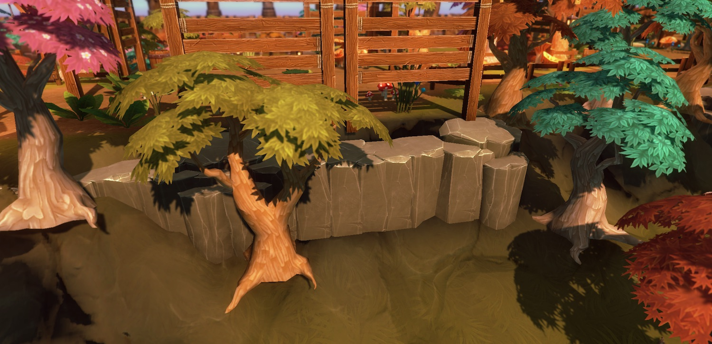
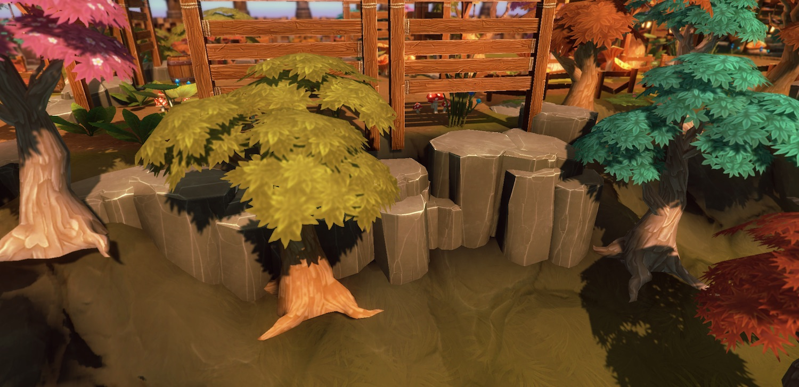

Rules
=====

You can attach script to add logic on the theme nodes for more control. There are two types of rules you can attach to Visual nodes


Selection Rule
--------------
A selection rule is a behavior script that is used to decide if the current node is to be attached to the scene.  This rule replaces the default **Probability** property that is used for randomly deciding if visual node needs spawning based on a probability.

Selection rules gives you more power, when you need it.   In the rule's script logic, you can query the dungeon model and determine if this node should be inserted into the scene

###Using Selection Rules
To assing an existing rule into the node, Check the **Use Selection Logic** property and drop in the *Selection Rule* script you would like to attach to the node


You can create new Selection Rules by overriding the `AlternateSelectionRule` class under the `DungeonArchitect` namespace

```
using UnityEngine;
using System.Collections;
using DungeonArchitect;

public class MySelectionRule : SelectorRule {
	public override bool CanSelect(PropSocket socket, Matrix4x4 propTransform, DungeonModel model, System.Random random) {
		bool selected = false;
		// Your selection logic here

		return selected
	}
}

```

### Example #1

This theme decorates the sides of the walls with props.  Sometimes, they get in the way and block the doors.   


A selection rule is used to query the dungeon model and check if it is near a door.  If so, it returns false indicating that we don't want to insert it here


```
using UnityEngine;
using System.Collections;
using DungeonArchitect;
using DungeonArchitect.Utils;

public class NonDoorTileSelectionRule : SelectorRule {
	public override bool CanSelect(PropSocket socket, Matrix4x4 propTransform, DungeonModel model, System.Random random) {
		if (model is GridDungeonModel) {
			var gridModel = model as GridDungeonModel;
			var config = gridModel.Config as GridDungeonConfig;
			var cellSize = config.GridCellSize;

			var position = Matrix.GetTranslation(ref propTransform);
			var gridPositionF = MathUtils.Divide (position, cellSize);
			var gridPosition = MathUtils.ToIntVector(gridPositionF);
			var cellInfo = gridModel.GetGridCellLookup(gridPosition.x, gridPosition.z);
			return !cellInfo.ContainsDoor;
		} else {
			return false;
		}
	}
}

```

### Example #2

In this Diablo like dungeon level,  the way our camera is setup, we don't want a room wall to block our view when we are inside a room

So a we create non-view blocking fences instead of walls at certain wall facing directions


In the above theme, the rule is attached to the first node, and if true, it would emit a **RoomblockingWall** marker which would create a wall and decorative props.  Otherwise, it would proceed to the next node, which emits a **Fence** marker and would create the fence meshes defined under it

This is done with a simple rule that checks the direction of the wall and decides if the view would be blocked from here

```
using UnityEngine;
using System.Collections.Generic;
using DungeonArchitect;
using DungeonArchitect.Utils;

public class NonViewBlockingSelectionRule : SelectorRule {
	static Vector3[] validDirections = new Vector3[] {
		new Vector3(1, 0, 0),
		new Vector3(0, 0, 1),
	};

	public override bool CanSelect(PropSocket socket, Matrix4x4 propTransform, DungeonModel model, System.Random random) {
		var rotation = Matrix.GetRotation(ref socket.Transform);
		var baseDirection = new Vector3(1, 0, 0);
		var direction = rotation * baseDirection;
		foreach (var testDirection in validDirections) {
			var dot = Vector3.Dot(direction, testDirection);
			if (dot > 0.707f) return true;
		}
		return false;
	}

}

```


### Example #3

In this example the towers are too crowded and close to each other.    


A selector rule is created to select alternate cells


```
using UnityEngine;
using System.Collections;
using DungeonArchitect;

public class AlternateSelectionRule : SelectorRule {
	public override bool CanSelect(PropSocket socket, Matrix4x4 propTransform, DungeonModel model, System.Random random) {
		return (socket.gridPosition.x + socket.gridPosition.z) % 2 == 0;
	}
}

```

The above logic uses a checker board pattern, where you sum the X and Y position and return true if it is an even number


Transform Rule
--------------

Dungeon Architect lets you specify offsets to your visual nodes to move/scale/rotate them from their relative marker locations.


However, if you want a more dynamic way of applying offsets (based on scripts), you can do so with a *Transform Rule*.  This can be very useful to add variations to your levels for certain props


###Using Transform Rules
To assing an existing rule into the node, Check the **Use Transform Logic** property and select the rule you would like to attach to the transform script 


You can create new transform rules by implementing the `TransformationRule` class under the `DungeonArchitect` namespace

```
using UnityEngine;
using System.Collections;
using DungeonArchitect;
using DungeonArchitect.Utils;

public class RandomRotYTransformRule : TransformationRule {
	
	public override void GetTransform(PropSocket socket, DungeonModel model, Matrix4x4 propTransform, System.Random random, out Vector3 outPosition, out Quaternion outRotation, out Vector3 outScale) {
		base.GetTransform(socket, model, propTransform, random, out outPosition, out outRotation, out outScale);

		// Your transform logic here. 
		// Update the outPosition, outRotation or outScale if necessary
	}
}

```


###Example #1

In this example, the cliff rocks are facing the same direction and look boring and unnatural






```
using UnityEngine;
using System.Collections;
using DungeonArchitect;
using DungeonArchitect.Utils;

public class RandomCliffTransformRule : TransformationRule {
	
	public override void GetTransform(PropSocket socket, DungeonModel model, Matrix4x4 propTransform, System.Random random, out Vector3 outPosition, out Quaternion outRotation, out Vector3 outScale) {
		base.GetTransform(socket, model, propTransform, random, out outPosition, out outRotation, out outScale);
		
		// Randomly rotate along the Y-axis
		var angle = random.NextFloat() * 360;
		var rotation = Quaternion.Euler(0, angle, 0);
		outRotation = rotation;

		// Slightly translate the node
		var variation = new Vector3(0.25f, -1, 0.25f);
		outPosition = Vector3.Scale (random.OnUnitSphere(), variation);
	}
}

```

A similar rule is applied to trees to randomly rotate them along the Y-axis and randomly scale them slightly


###Example #2

In this example, the outer trees are spawned in the same height as the dungeon layout


However, we also have a terrain that Dungeon Architect modifies, whose steepness value is controlled by the user using a curve.  

So, we would like to clamp this tree's base on the dynamic terrain.   


This is done by finding the height of the terrain at that location, and creating an offset such that the tree would move up or down to properly clamp on it

```
using UnityEngine;
using System.Collections;
using DungeonArchitect;
using DungeonArchitect.Utils;

public class ClampToTerrainTransformRule : TransformationRule {
	
	public override void GetTransform(PropSocket socket, DungeonModel model, Matrix4x4 propTransform, System.Random random, out Vector3 outPosition, out Quaternion outRotation, out Vector3 outScale) {
		base.GetTransform(socket, model, propTransform, random, out outPosition, out outRotation, out outScale);

		var terrain = Terrain.activeTerrain;
		if (terrain == null) {
			return;
		}

		var position = Matrix.GetTranslation(ref propTransform);
		var currentY = position.y;
		var targetY = LandscapeDataRasterizer.GetHeight(terrain, position.x, position.z);

		// Apply an offset so we are touching the terrain
		outPosition.y = targetY - currentY;
	}
}

```


###Example #3

In this example a small random rotation is applied to ground tiles.  Useful while creating ruins when laying down broken tile meshes


```
using UnityEngine;
using System.Collections;
using DungeonArchitect;
using DungeonArchitect.Utils;

public class BrokenTilesTransformRule : TransformationRule {

	public float maxAngle = 5;

	public override void GetTransform(PropSocket socket, DungeonModel model, Matrix4x4 propTransform, System.Random random, out Vector3 outPosition, out Quaternion outRotation, out Vector3 outScale) {
		base.GetTransform(socket, model, propTransform, random, out outPosition, out outRotation, out outScale);
		
		var rx = random.Range(-maxAngle, maxAngle);
		var ry = random.Range(-maxAngle, maxAngle);
		var rz = random.Range(-maxAngle, maxAngle);
	
		outRotation = Quaternion.Euler(rx, ry, rz);
	}
}

```


