Paint Mode
==========

Dungeon Architect also allows you to paint your own dungeon layouts with an editor extension.  This gives you more artistic control as you are no longer restricted by what the procedural algorithm creates for you

To Activate the Paint Editor mode and start painting, expand the DungeonGrid game object and select the PaintMode game object.    This would change your editor's scene view into **Paint Mode**

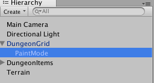

When you are in the Paint Mode, the Scene View shows the layout of your dungeon in Blue

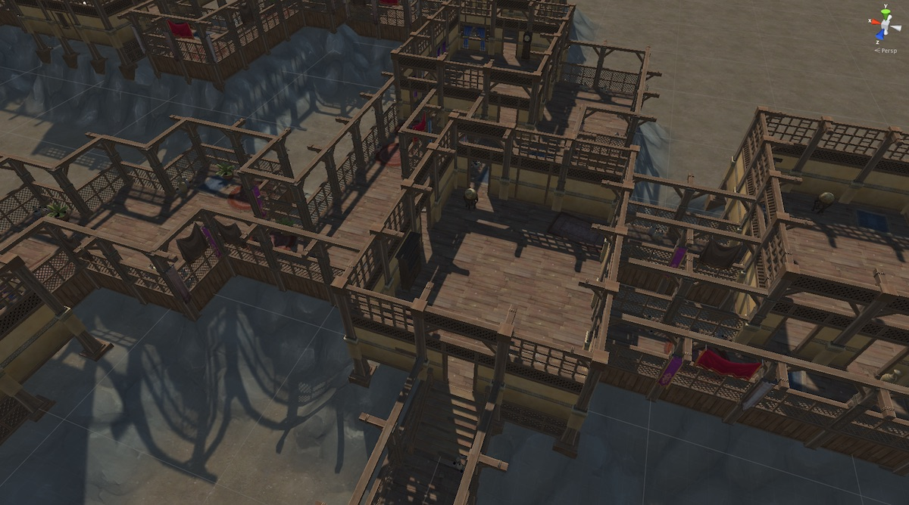
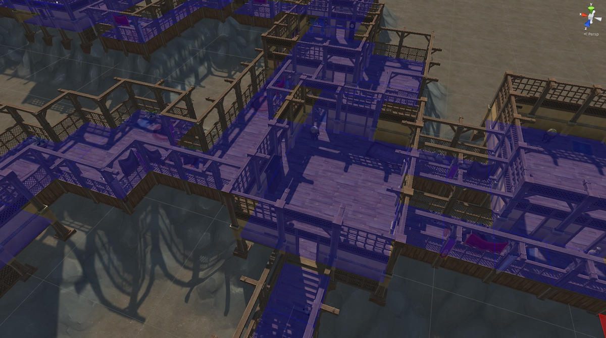

You can now paint your layout on the Scene View

* **Left Click:** Paint layout
* **Shift + Left Click:** Delete painted layout
* **Mouse Wheel:** Change paint height

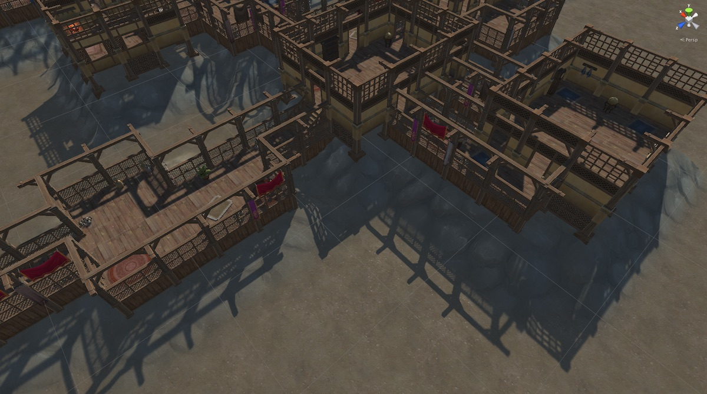

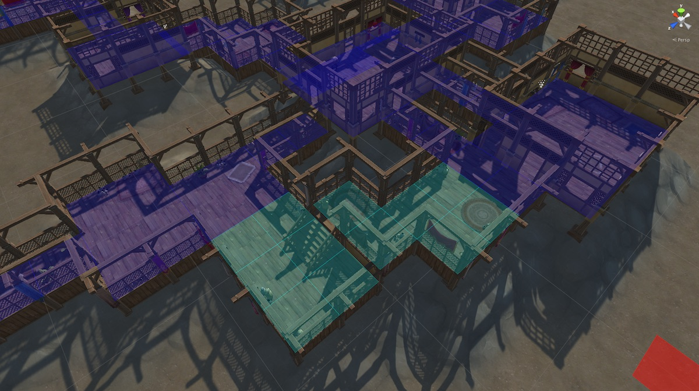

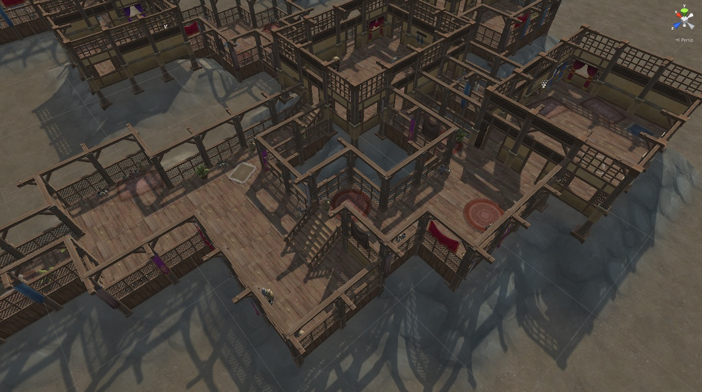

Another Example:
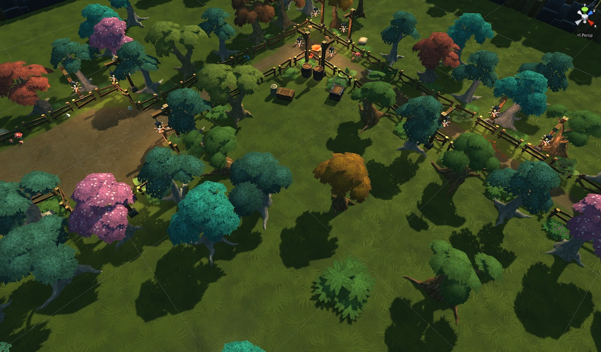
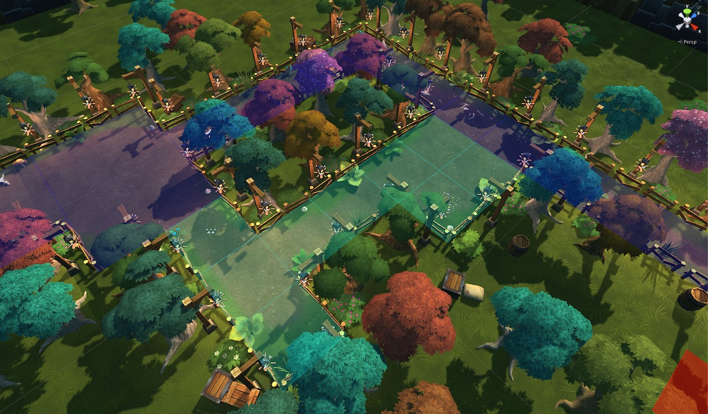
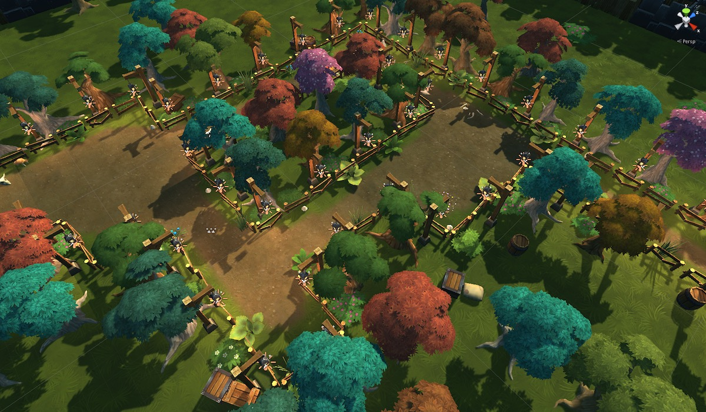
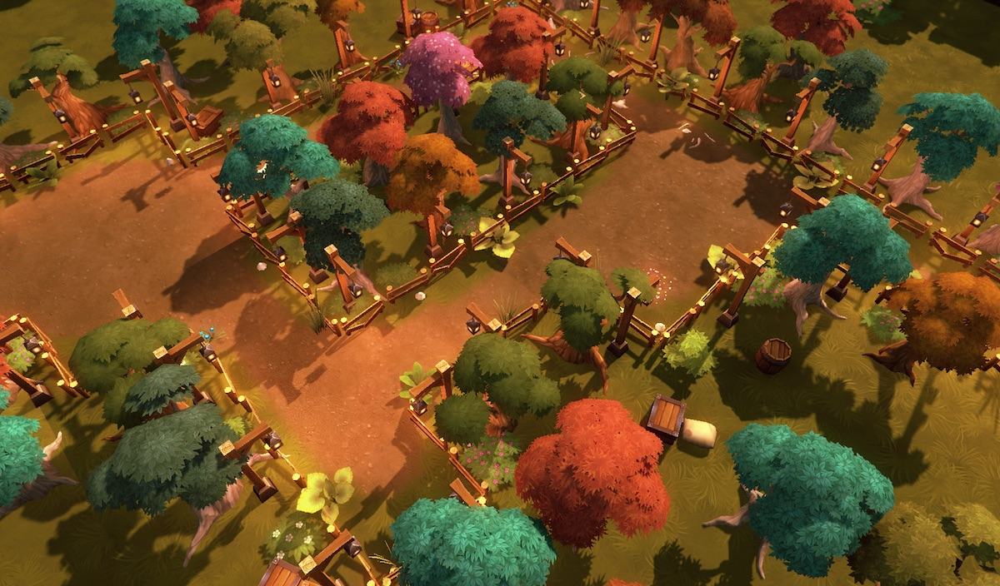

Paint Mode Properties
---------------------

When you select the Paint mode game object, you can set various parameters to control the paint tool:

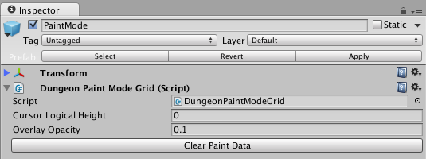

Non-Procedural Painting
-----------------------

If you do not want any procedural content to be generated when you paint your level, then set the **Num Cells** property to `0` in your Dungeon Actor's Configuration section

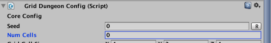

This way the dungeon would have an empty layout, allowing you to paint from scratch

If you do want procedural content but want to remove certain procedural areas that are getting in your way, then use a *Negation Volume*
