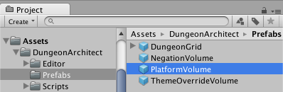
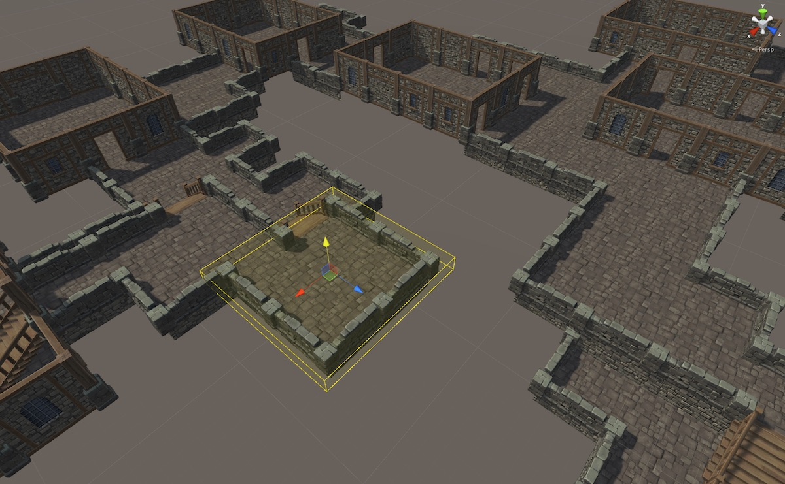

Volumes
=======

Dungeon Architect provides various volumes to help you influence your dungeon as per your requirements.

You can find the various volume prefabs under `Assets/DungeonArchtitect/Prefabs`

Platform Volume
---------------

Place a platform volume anywhere in the scene and Dungeon Architect would adjust the dungeon layout and create a platform (room or corridor) at that location.  Scale the volume along the XZ plane to change the size of the generated platform.   You can move the platform volume with the move tool to the desired location. (Rotation is not supported)

This gives you artistic control and lets you manipulate the dungeon to suit your needs

To place a platform volume,  navigate to `Assets/DungeonArchtitect/Prefabs`

Drag and drop the Platform Volume Prefab into the scene view

Select the platform volume and have a look at it's properties

The Volume needs to know which dungeon the volume belongs to (DA Supports mulitple dungeons within the same scene). 

Assign the dungeon you'd like this volume to affect in the **Dungeon** field

Select the type of cell to create on this platform's location (Room or Corridor)

Corridors form isolated platforms in the dungeon which merge nicely with existing corridor cells

Rooms always connect to atleast one other room in the dungeon.  Changing the Cell type to *Room* creates this result

A button to rebuild the dungeon is provided for convenience.  It rebuilds the dungeon in the scene

Theme Override Volume
---------------------
Give certain areas of you dungeons a different look and feel.   Layout inside this volume would use the theme defined by this volume.  

This is useful for adding variations to your level

Select the theme override volume and have a look at it's properties

**Dungeon**: Set the dungeon game object this volume should affect

**Override Theme**: Set the dungeon theme asset you would like to apply to the geometry within this volume

Note: When overriding, the themes needs to be designed for the same grid cell size for proper results

A button to rebuild the dungeon is provided for convenience.  It rebuilds the dungeon in the scene

Negation Volume
---------------
This volume removes all procedural geometry inside of this volume.  Use this to get rid of procedural geometry in areas you do not need or when it is getting in the way while manually painting your layout

Select the negation volume and have a look at it's properties

**Dungeon**: Set the dungeon game object this volume should affect

A button to rebuild the dungeon is provided for convenience.  It rebuilds the dungeon in the scene
