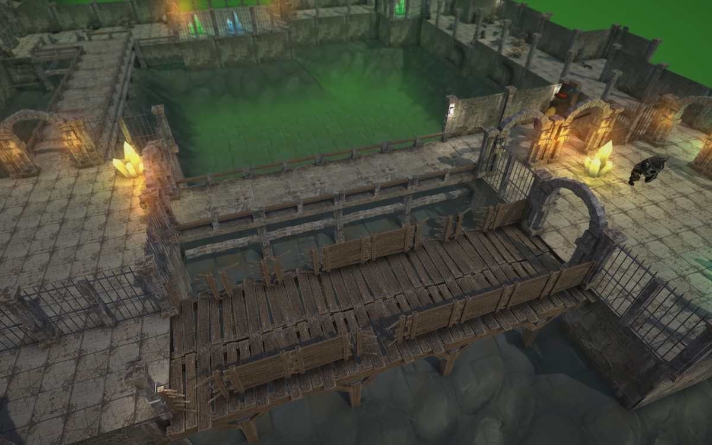
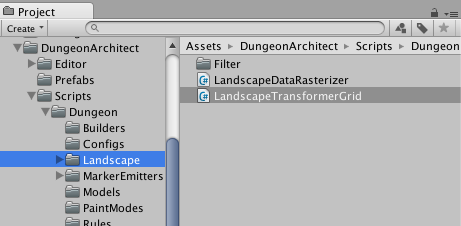
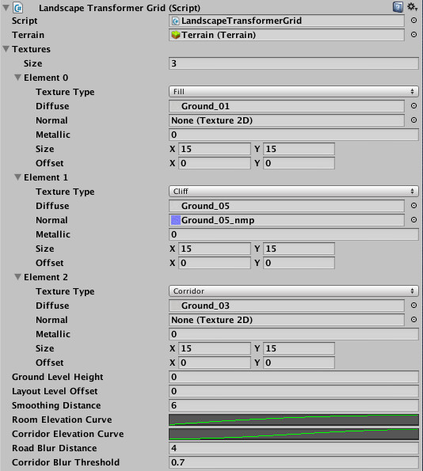
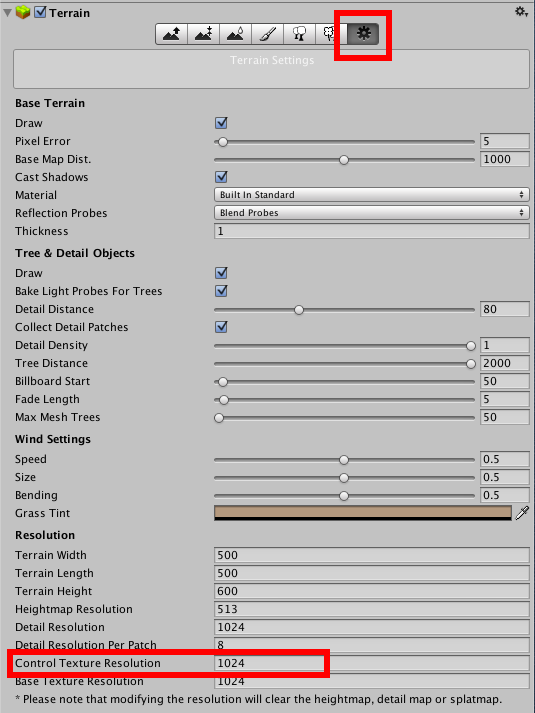
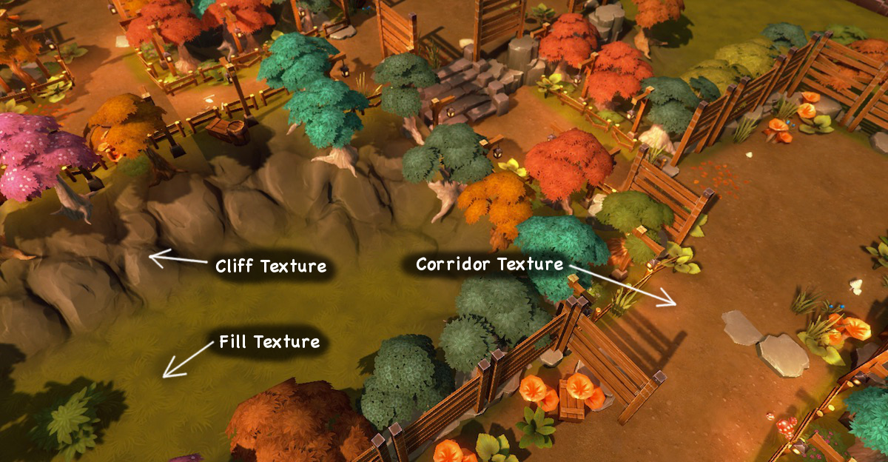
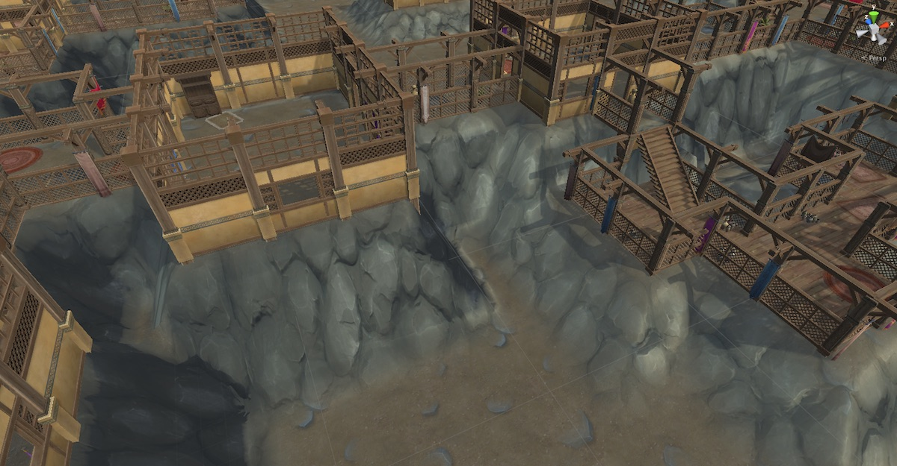
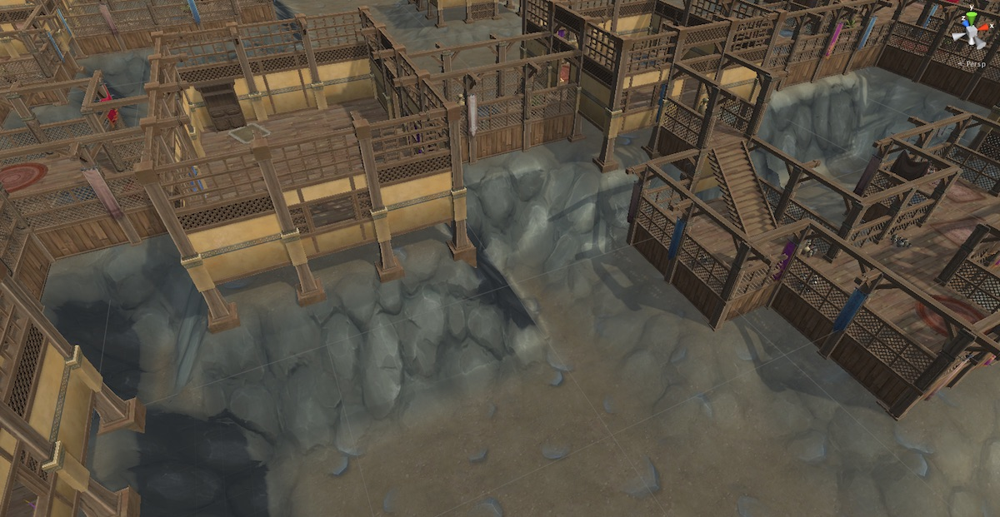
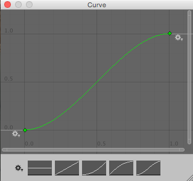
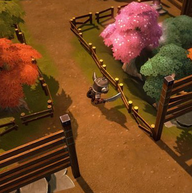

Landscape Transformer
====================

Dungeon architect can also modify the landscape when it builds the dungeon.   Starting with an empty terrain, it can modify its height and paint it in intresting ways.

In the above screenshot, a blank terrain was provided as input to the script.  It has updated its height (based on a steepness curve provided by the user) and painted the ground, cliffs and pathways with input textures (notice the organic dirt pathway along the layout)

Here's another Example:

Usage
-----

Navigate to `Assets/DungeonArchitect/Scripts/Dungeon/Landscape`

Attach the script `LandscapeTransformerGrid` to the Dungeon actor

### Terrain Setup

Create a new terrain and center it on the dungeon (e.g. set the X and Z to -250). 

Also move the terrain down along Y by around -20 (an approx lowest point your dungeon layout might reach).  This is needed because the height map doesn't take negative values

Select the terrain and go to settings and set the Control Texture Resolution

### Properties

**Terrain**: Assign the this terrain reference to the **Terrain** field in the above script properties

**Textures:** Assign textures to paint the terrain transformer script and the terrain would be painted based on the texture type

**Ground Level Height**: Set the default ground level height of the terrain

**Layout Level Offset**:  If set to 0, the terrain would raise up to touch the layout of the dungeon. Sometimes you would like this value to be lower, if you already have a ground mesh like the image below

**Room Elevation Curve:** The curve defines the steepness of the landscape around the rooms

**Corridor Elevation Curve:** The curve defines the steepness of the landscape around the corridors

Assign a preset curve if unassigned for the transformer to work properly

**Smoothing Distance**: The distance to perform the smoothing of the heights using the above curves

**RoomBlurDistance / CorridorBlurDistance**: A smooth pathway is painted on the landscape using blurring algorithms. These fields affect how the smooth corridor painting is performed along the rooms and corridors

