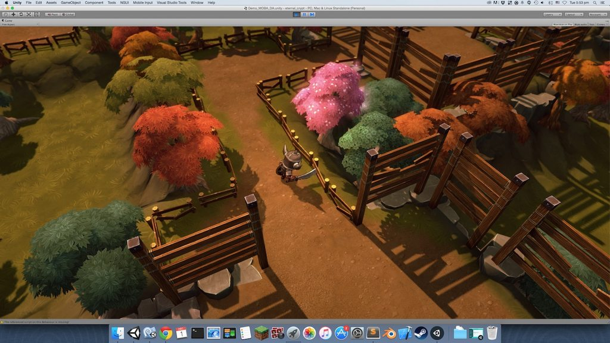

Landscape Transformer
====================

Dungeon architect can also modify the landscape when it builds the dungeon.   Starting with an empty terrain, it can modify its height and paint it in intresting ways.

In the above screenshot, a blank terrain was provided as input to the script.  It has updated its height (based on a steepness curve provided by the user) and painted the ground, cliffs and pathways with input textures (notice the organic dirt pathway along the layout)

Add the landscape transformer script to your dungeon game object to 

`LandscapeTransformerGrid`

This builder extends the default Grid based builder and carves out out the landscape around the layout.

**Note:** This builder is disabled in the current build as it is still a work in progress

