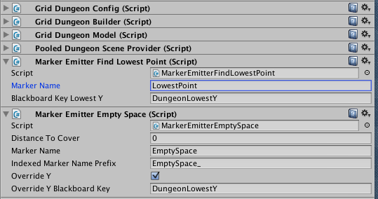
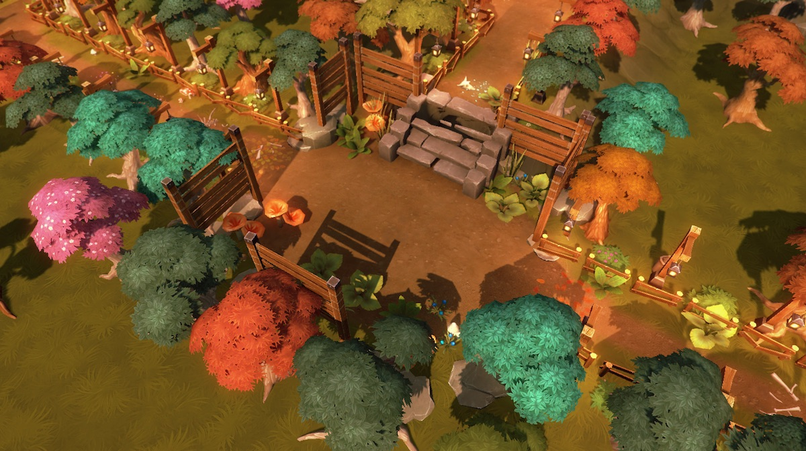
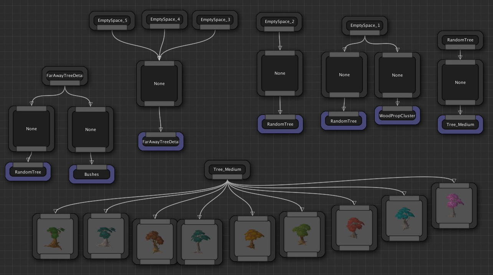
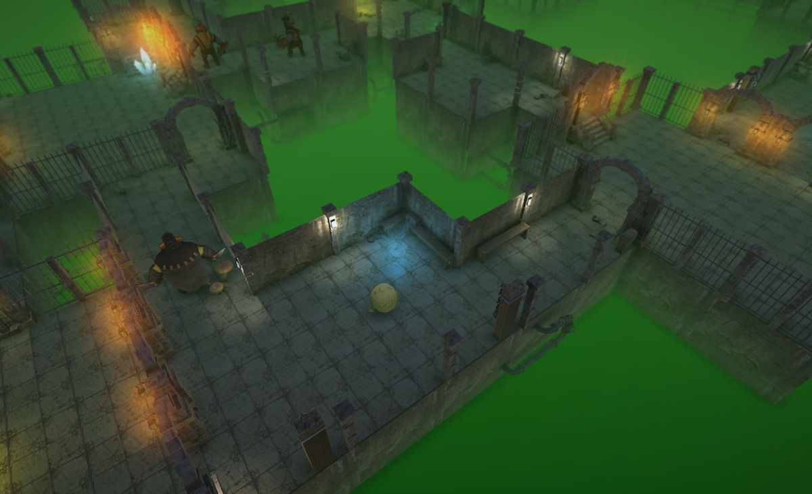
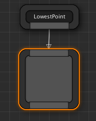
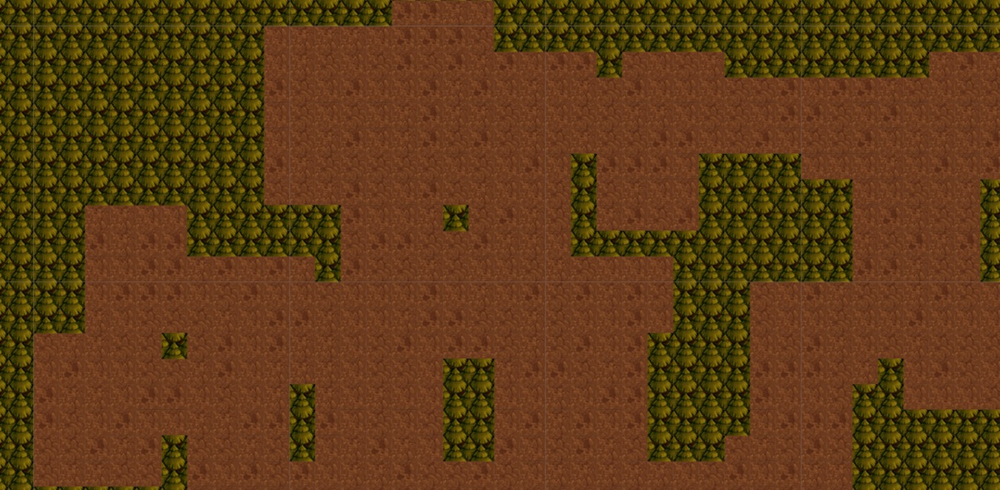
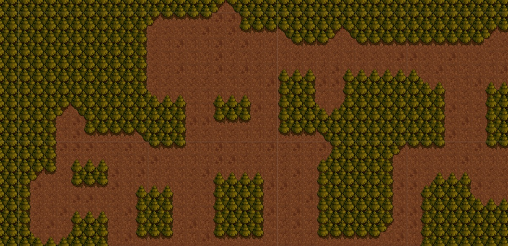
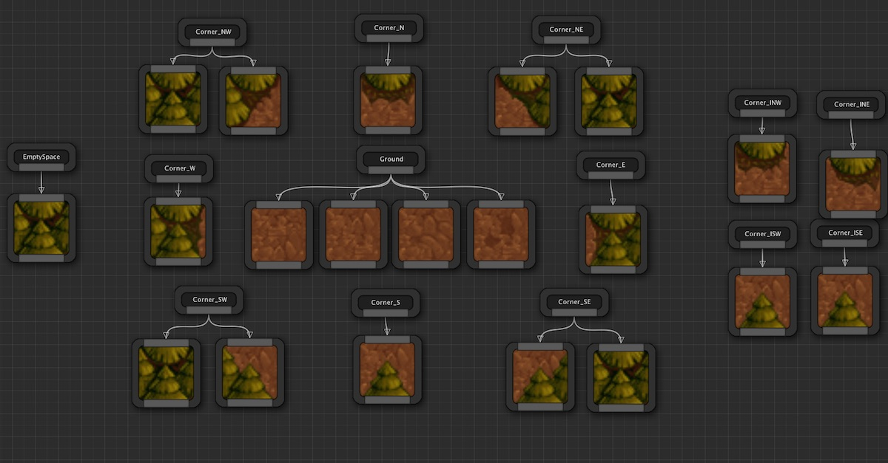

Marker Emitter Scripts
======================

Marker Emitters are behavior scripts that lets you emit your own markers anywhere in the map


As seen previously, *Markers* are emitted by the Dungeon Builder class around the layout of the dungeon (e.g. Wall, Ground, Fence etc) and you can insert actors at that location from the Theme graph.  You can even create your own markers emitted off of those parent markers, but without *Marker Emitters* you are restricted to the starting markers the dungeon builder has initially emitted for you

Marker Emitters gives you a lot of flexibility and you can query the dungeon model and emit markers anywhere in the map

A Marker Emitter is invoked right after the Dungeon Builder emits all the markers for the dungeon (Ground, Wall etc)

Creating a Marker Emitter
-------------------------

To create a Marker Emitter, you need to create a script inherited from `DungeonMarkerEmitter` under the `DungeonArchitect` namespace

```
using UnityEngine;
using System.Collections;
using DungeonArchitect;
using DungeonArchitect.Utils;

public class MyAwesomeEmitter : DungeonMarkerEmitter 
{
    public override void EmitMarkers(DungeonBuilder builder)
    {
		base.EmitMarkers(builder);

		// Your emitter logic here

		// Emit as many markers as you like. 
		// Emit a marker like this:

		// Fill up the marker data
		var markerName = "MyMarker";	// This name will be picked up in your theme file
        var transform = Matrix4x4.TRS(position, rotation, scale);

        // Additionaly specify the grid based meta data (optional)
        var gridPosition = new IntVector(); // specify a position value here in grid coordinates
        var cellId = -1;

        builder.EmitMarker(markerName, transform, gridPosition, cellId);
	}
}

```

To attach a marker emitter to your Dungeon game object, simply add this script to the game object



Explore the existing marker emitters that come with Dungeon Architect under `Assets/DungeonArchitect/Scripts/MarkerEmitters/Grid`

Example #1
----------



In this example, we'd like to decorate the area outside the dungeon layout that Dungeon Architect has created for us.  Since DA creates marker points within the layout, we create a marker emitter to find nearby points in the empty space and emit markers named "EmptySpace_N" where N is 1, 2, 3, 4, 5 etc.  These markers are then available to us in the themem file




Example #2
----------

Sometimes, it's useful to find the lowest point of the dungeon, so a large plane can be placed there (e.g. water plane, lava plane etc)

The `MarkerEmitterFindLowestPoint` lets you do just that



This emitter emits a marker named `LowestPoint`, at the lowest Y point of the dungeon with the appropriate scale, which we can decorate with any object in the theme file




Example #3
----------

A marker emitter is created to add extra contextual markers to beautify a 2D level layout (can also be used with 3D)

Check the marker named `MarkerEmitterCornerBeautifier`







All the `Corner_*` markers seen in the theme file above were emitted by the marker emitter script

