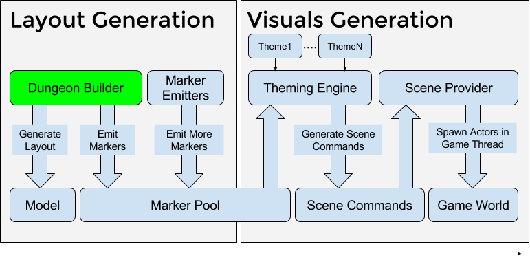
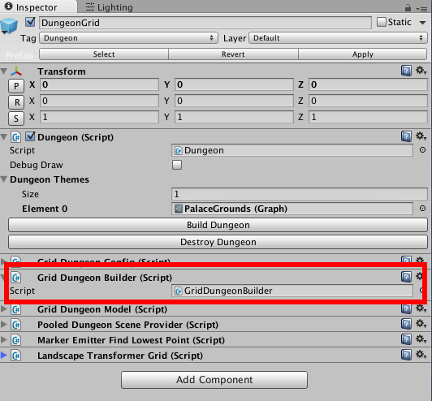

Dungeon Builders
================
The Default dungeon builder used to create the layout is swappable and you can provide your own implementation




This is useful if you want to use your own algorithm for generating the layout of your dungeons.  

You are not limited to a grid based system.  


Creating a new Builder
----------------------

To create a new builder, subclass `DungeonBuilder` under the `DungeonArchitect` namespace and implement the virtual methods

```
using UnityEngine;
using System.Collections;
using System.Collections.Generic;
using System.Linq;
using System.Text;
using DungeonArchitect.Utils;

[ExecuteInEditMode]
public class MyDungeonBuilder : DungeonBuilder
{

    public override void BuildDungeon(DungeonConfig config, DungeonModel model) {
		base.BuildDungeon(config, model);

		// Add your builder logic here
    }


    public override void EmitMarkers() {
		base.EmitMarkers();

		// Emit markers here by calling EmitMarker()
	}
}

```

Have a look at `GridDungeonBuilder` under `Assets/DungeonArchitect/Scripts/Builders/GridDungeonBuilder.cs` for reference


Using a different Builder
-------------------------

If you've created a builder and would like to use it with your dungeon actor, drop in an existing dungeon actor, remove the existing builder script and replace it with your own




