Navigation Mesh
===============

Dungeon Architect supports runtime navigation mesh generation, which is not supported in Unity 5 yet.   This is necessary for moving your NPCs intelligently across your procedurally generated level

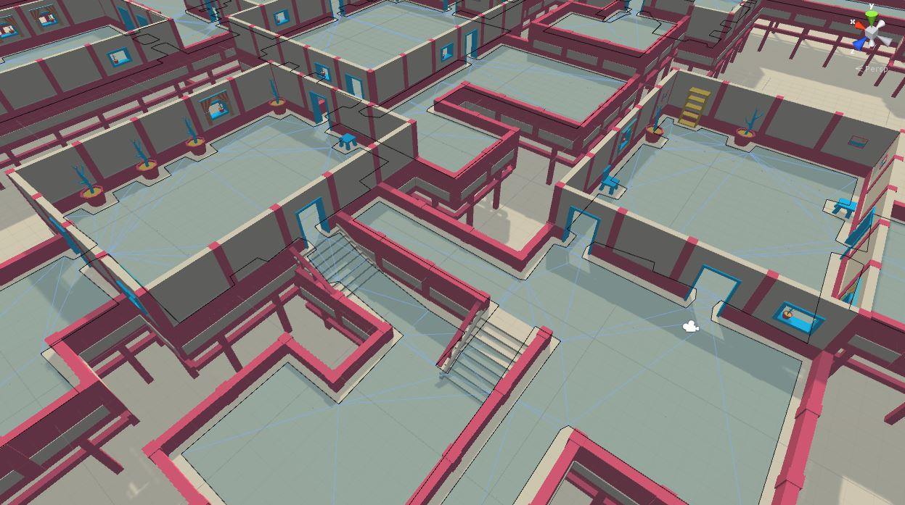

This is based on the Recast Navigation library, so it provides very high quality results.

Setup
-----
To build a navigation mesh during runtime, place the DungeonNavigation prefab on to your scene

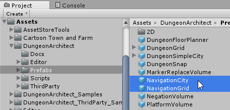

Select the game object you just placed and have a look at the inspector window

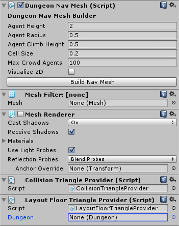

To build the nav mesh, input geometry for walkable and blocked areas needs to be provided.  This is done by `Triangle Providers`

There are two types of triangle providers already attached to the navigation object

 - **Collision Triagle Provider**: Uses the collision mesh of the colliders present in the scene to build the navigation mesh
 - **Layout Floor Triangle Provider**: This provides the floor layout of a dungeon as walkable area to the navigation mesh input

Assign the dungeon reference you would like to use 

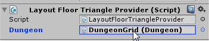
 
 
Click Build

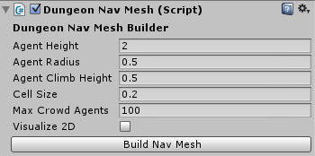


Theme Influence
---------------
The dungeon objects (meshes, prefabs etc) do not affect the navigation by default.  You need to set the **Affects Navigation** flag of the visual node to make it affect the navigation.

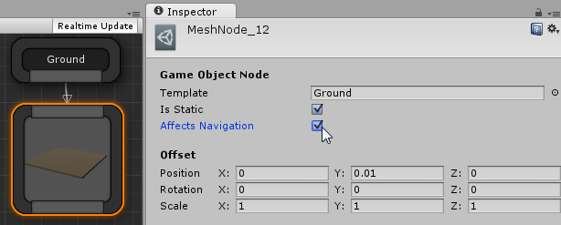

The object also has to be static in order to affect the navigation.   So the **Is Static** flag also needs to be set.

Important: You should set the *Affects Navigation* flag only when it is absolutly required to maintain a good nav mesh generation speed while building


Config
------


- **Cell Size**:  Controls the mesh generation accuracy vs speed. It determines the resolution of the generated nav mesh.   Lowering this number will generate nicer edges and a more accurate navmesh but requires more procesing power and slower.  A good value is between 0.2 to 0.3
- **Agent Height**: The max height of the agents in your game
- **Agent Radius**: The max radius of the agents in your game
- **Agent Climb Height**: The max height an agent can climb on. Objects with height lower than this will not be considered obstacles, as the agent would be able to climb over them
- **Max Crowd Agents**: The max no. of agents that can be present in the game at a time.  

Triangle Providers
------------------
To generate a navigation mesh,  the nav mesh system requires input triangles so it can build a world and generate the nav mesh.   Dungeon Architect comes with various triangle providers to help you affect the nav mesh in various ways.  We have seen two of them already above

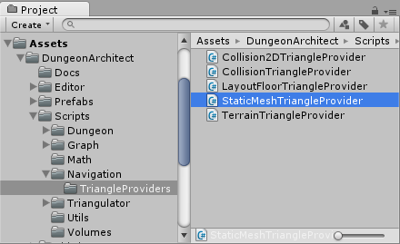

- **StaticMeshTriangleProvider**: Uses the mesh geometry (vertices, indices) for all the meshes defined in the prefab as a source for the input triangles to generate the nav mesh.  This is usually slower but creates detailed results
- **CollisionTriangleProvider**: Uses the colliders defined in the prefab as a source for the input triangles to generate the nav mesh.  This is much faster than the StaticMesh triangle provider as it works with the low poly collision geoemtry.  However it requires a collider to be present in the prefab to work
- **TerrainTriangleProvider**: Feeds the terrain geometry into the nav  mesh generation system.  So you can have your dynamic navmesh build around terrains
- **LayoutFloorTriangleProvider**: Feeds the layout of a dungeon to the nav mesh generation system.  This is usually faster than providing a ground mesh in the CollisionTriangleProvider

You can use multiple triangle providers at once.   You can use only the CollisionTriangleProvider for better performance.  However, you can increase the performance even further by disabling the gound mesh from affecting your navigation (because there will be lots of ground meshes) and providing that ground data from an additional LayoutFloorTriangleProvider script.


Navigation Agent
----------------
Use the NavAgent to move your NPCs in the dynamic navigation mesh

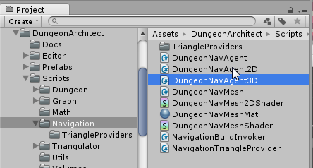

An fully working example of this with AI is provided in the SurvivalShooter demo game bundled with Dungeon Architect

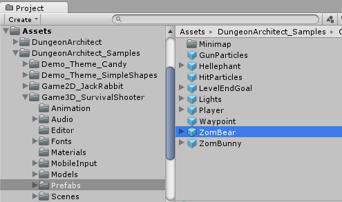

The nav mesh agent requies a CharacterController script to be present in the game object

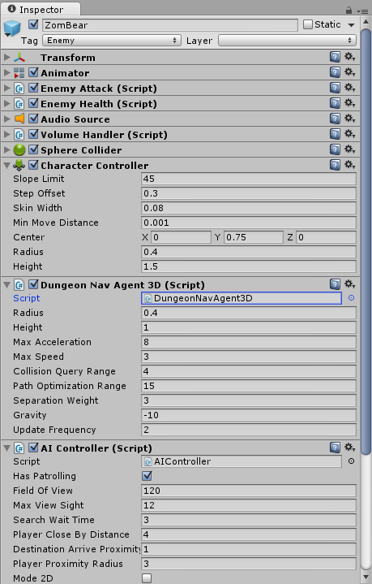

```
	var agent = GetComponent<DungeonNavAgent>();
	
	// Move the agent to the target position
	agent.Destination = targetPosition;
	
	var velocity = agent.Velocity;	// Agents velocity
	var direction = agent.Direction;	// Agents movement direction
	var distanceToDestination = agent.GetRemainingDistance();
	
	// Stop moving the agent
	agent.Stop();
	
	// Resume movement
	agent.Resume();

```


Have a look at the shooter game demo in the samples folder for a complete example

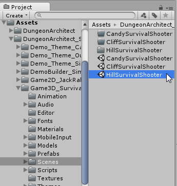

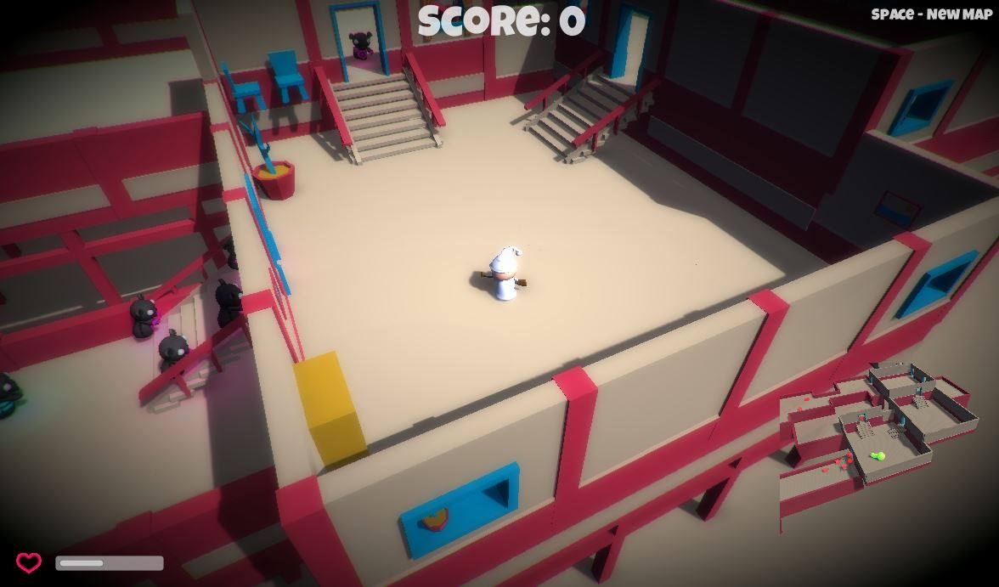

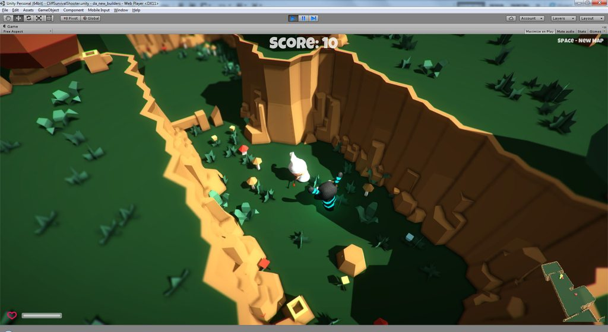

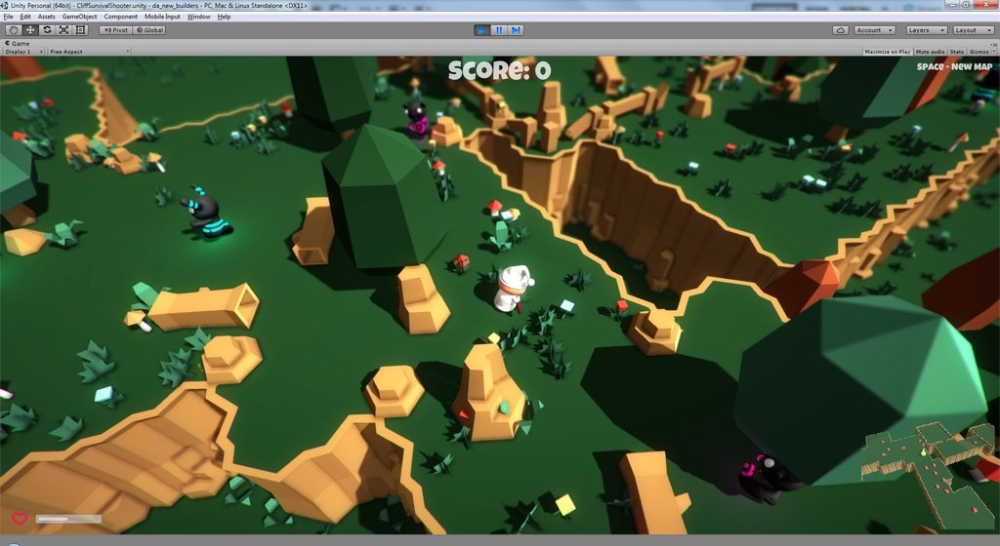


