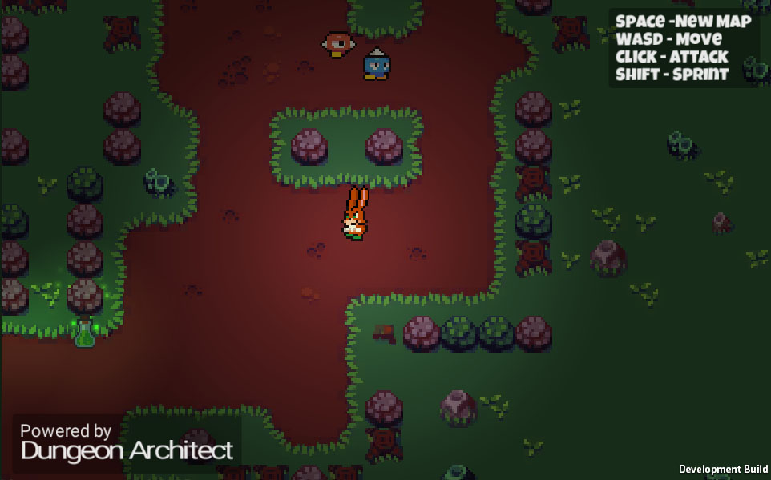
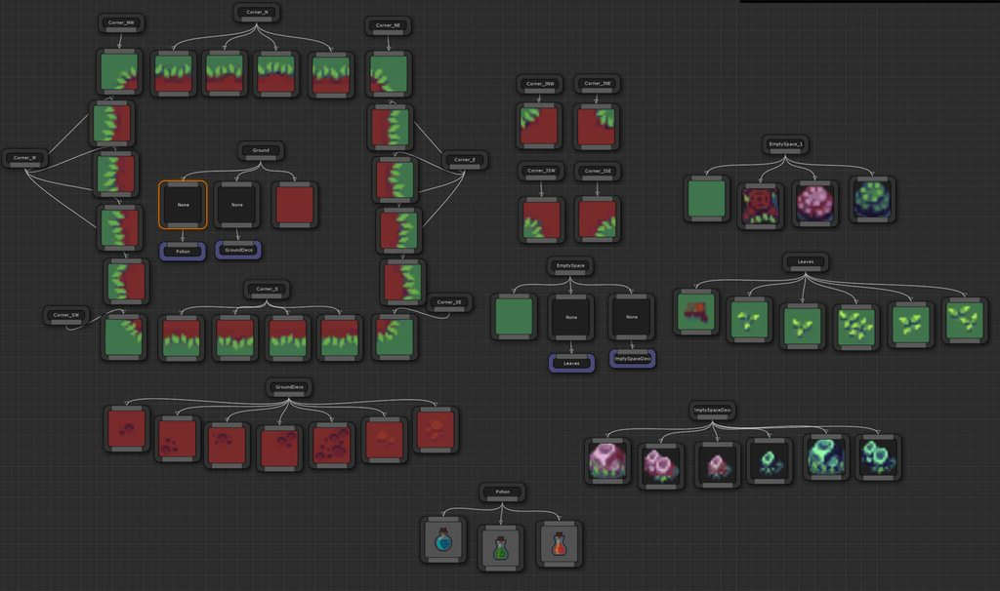
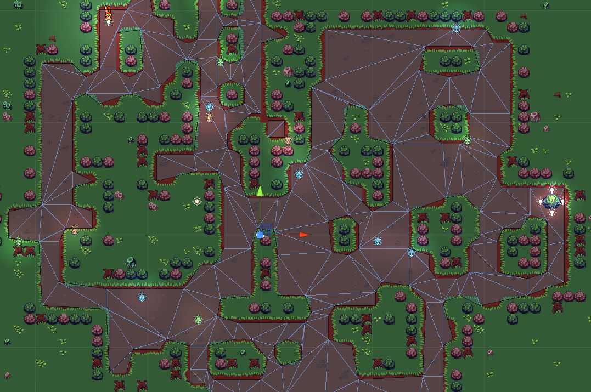

2D Support
==========

Dungeon Architect fully supports 2D.   You can use the same workflow to create beautiful 2D levels.

A sample 2D game comes along with Dungeon Architect to help you get started.   It demos dynamic 2D procedural level generation, dynamic 2D navigation mesh generation, 2D AI with patrol, seek and search behaviours

2D dynamic navigation mesh generation is also support.   

